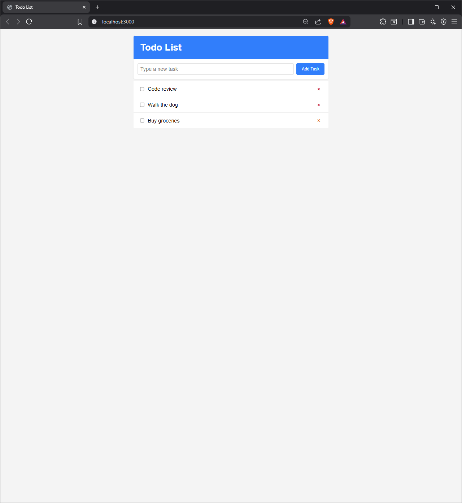
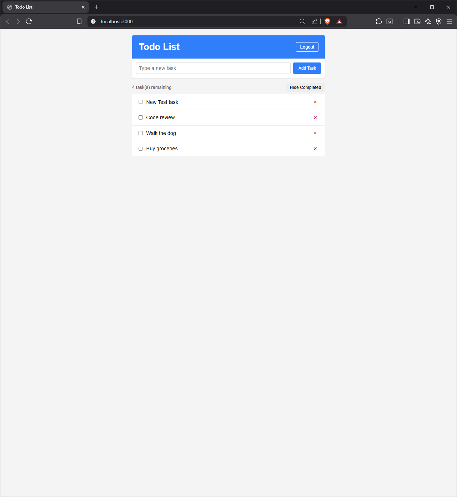
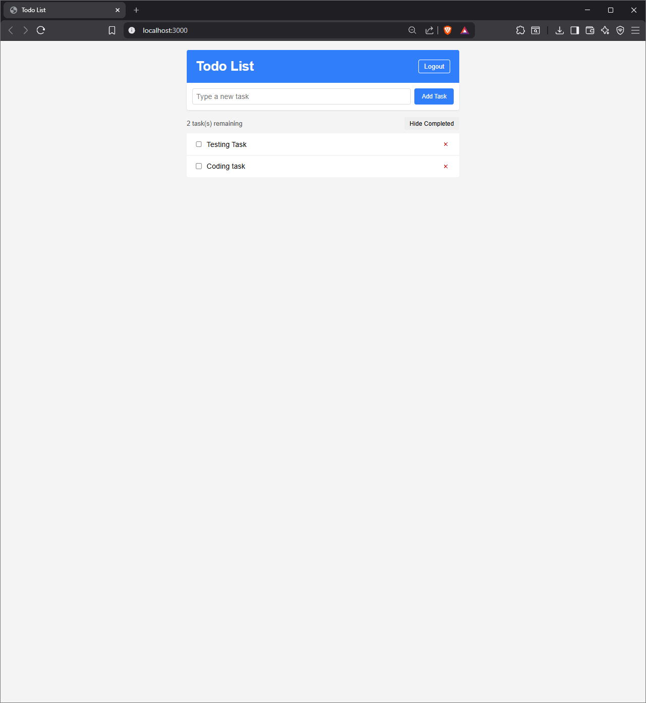
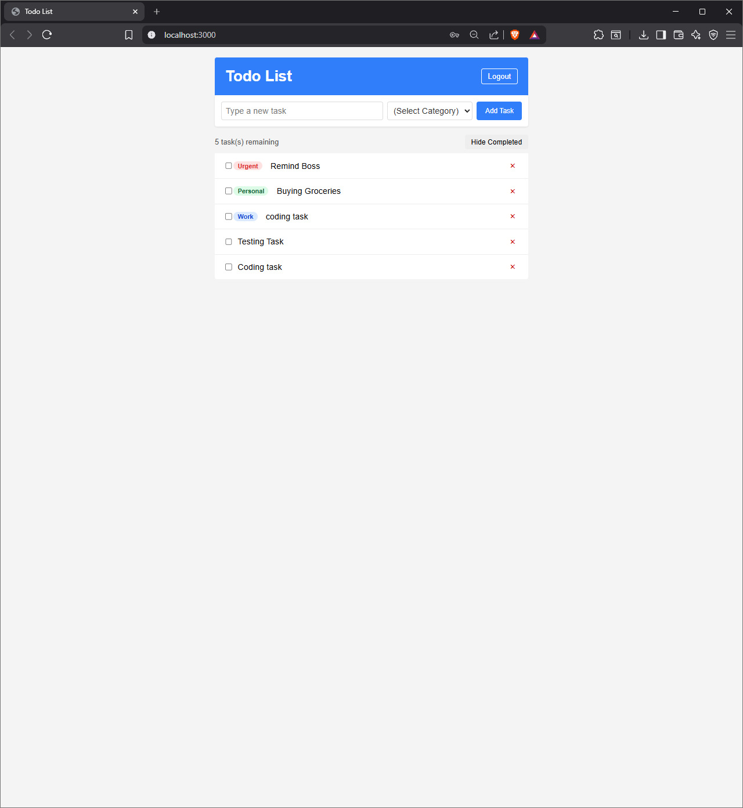

# Simple Todos — Meteor Blaze
### A full-stack todo application built with Meteor 3.4.1 and Blaze

## Overview
I built this full-stack app to let users manage their personal todo lists. I followed the official Meteor Blaze tutorial to build the core setup. Then I added two features: task categories and drag-and-drop task reordering.

## Features
- Task creation, task deletion, and checking/unchecking tasks
- Toggle to hide completed tasks with a live count of tasks left
- Log in and log out using Meteor's accounts-password package
- Secure database writes using Meteor Methods instead of client writes
- Secure data access via publications so users only see their own tasks
- Task categories (Work, Personal, Urgent) with color badges
- Drag-and-drop list reordering that saves the new order to the database

## Tech Stack

| Technology | Version | Purpose |
| :--- | :--- | :--- |
| **Meteor** | 3.4.1 | App framework |
| **MongoDB** | Built-in | Database |
| **Blaze** | Built-in | HTML template engine |
| **SortableJS** | Latest | Drag-and-drop library |
| **accounts-password** | Meteor package | User login system |
| **reactive-dict** | Meteor package | Local UI state management |

## Getting Started

Follow these steps to run the application on your computer:

### Prerequisites
- Node.js 20+
- Meteor 3.x

### Installation Steps
1. Clone this repository to your computer:
   ```bash
   git clone https://github.com/YOUR_USERNAME/simple-todos-blaze.git
   ```
2. Go into the project directory:
   ```bash
   cd simple-todos-blaze
   ```
3. Install npm packages:
   ```bash
   meteor npm install
   ```
4. Run the Meteor app:
   ```bash
   meteor
   ```
5. Open your browser and go to http://localhost:3000
6. Log in with the test user:
   - Username: `meteorite`
   - Password: `password`

## Screenshots







## Project Structure
```text
simple-todos-blaze/
├── client/           # Browser entry point and CSS
├── server/           # Server entry, seeding
├── imports/
│   ├── api/          # Collection, Methods, Publications
│   └── ui/           # Blaze templates and JS
└── .meteor/          # Meteor internals
```

## Implementation Notes
I removed the `insecure` and `autopublish` packages to secure the app. Because of this, the client cannot write to the database directly. I wrote Meteor Methods on the server to handle inserts, deletes, and updates. These methods check `this.userId` to make sure the user is logged in. I also set up publications to ensure users only subscribe to their own tasks. For the drag-and-drop feature, I added an `order` field to each task document. When a user drags a task, SortableJS triggers a callback. This callback calls the update method on the server to save the new order in MongoDB.

## Future Improvements
- Could add a date picker to set due dates.
- Could add priority levels (like low, medium, and high).
- Could let users share tasks with other users.
- Could make it a PWA so it works offline on mobile.
